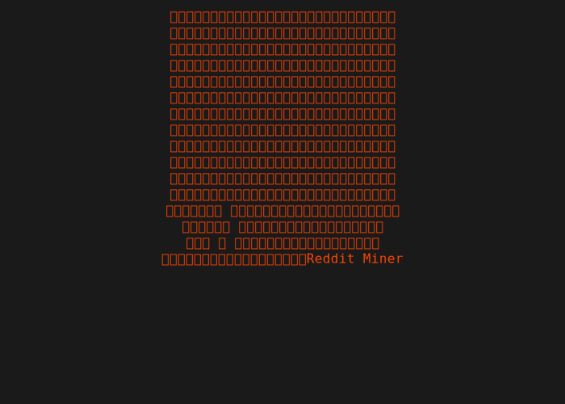

<p align="center">
  
</p>

<p align="center">
  
  &nbsp;&nbsp;
  
  &nbsp;&nbsp;
  
  &nbsp;&nbsp;
  
  &nbsp;&nbsp;
</p>

<p align="center">
  <strong>Hi, this is RedditMiner 👋</strong>
</p>

RedditMiner is a local, privacy-first Reddit user simulation engine. It fetches and persists a user’s comment history, analyzes writing style and behavior, then runs a local GPT4All model (with RAG) to simulate conversational responses that match that user’s voice.

---

## Quick highlights
- Fast, multi-threaded comment fetching via PRAW.
- Idempotent storage in PostgreSQL with Alembic migrations.
- Style and behavioral profiling (emoji use, punctuation, subreddit prefs, etc.).
- Retrieval-Augmented Generation (TF‑IDF) to ground responses in real examples.
- Runs fully offline with local GPT4All (.gguf models).
- Hexagonal architecture for testability and extensibility.

---

## Quickstart

1. Clone and install:
```bash
git clone <repo>
cd RedditMiner
# Use your preferred Python env / Poetry
poetry install
```

2. Configure credentials:
```bash
export REDDIT_CLIENT_ID="..."
export REDDIT_CLIENT_SECRET="..."
```

3. Add a GPT4All model:
- Place a .gguf file in `models/` (e.g., `Meta-Llama-3.1-8B-Instruct-*.gguf`).

4. Start the database:
```bash
make build_db
make start_db
# or run Alembic migrations manually:
poetry run alembic -c src/reddit_miner/adapters/db/migrations/alembic.ini upgrade head
```

---

## Typical workflows

- Fetch comments and persist to DB:
```bash
poetry run reddit-miner fetch-db --usernames spez --limit 1000
```

- Run an interactive chat that simulates a user (from DB or Excel):
```bash
poetry run reddit-miner chat --username spez
# or use an export file
poetry run reddit-miner chat --file reddit_comments_person.xlsx
```

- Export / one-off analysis:
```bash
poetry run reddit-miner export --username spez --format excel
```

---

## What it analyzes
- Top subreddits and posting cadence
- Average score and score distribution
- Word length, sentence length, and capitalization ratio
- Punctuation patterns (exclamation/question use)
- Emoji frequency and common tokens
These metrics are injected into the system prompt and used as metadata for RAG retrieval.

---

## Architecture (Overview)
- Core services: analysis, simulation, orchestration (deterministic, easy to test).
- Adapters: Reddit API, PostgreSQL, Excel I/O, GPT4All model loader.
- CLI: thin entrypoint that routes commands to core services.
This separation makes it straightforward to swap out storage, embedding/indexing strategies, or the LLM backend.

---

## Operational tips
- Use larger batches and backoff handling for large fetches.
- Store models on fast disks (loading large .gguf files can be slow).
- Use batch inserts for DB performance and keep Alembic migrations up-to-date.
- For better responses replace TF‑IDF with semantic embeddings when possible.

---

## Extensibility ideas
- Replace TF‑IDF with semantic vector search (FAISS, Milvus, etc.).
- Add web or desktop UI for conversation history and controls.
- Add rate-limiters, retry policies, and per-subreddit sampling strategies.

---

## Contributing
- Mock adapters for unit tests (reddit / db / gpt4all).
- Follow the hexagonal boundaries when adding features.
- Open PRs with tests and an Alembic revision when changing schema.

---

If you want, I can also rewrite the repo README top section to match your existing README style and command examples. 

## 🚀 **Why RedditMiner?**
- **Clone & Simulate**: Capture a Reddit user's historical voice and interact with a context-aware chatbot that mimics their style.
- **Fetch & Store**: Quickly retrieve user comments and persist them to PostgreSQL or Excel.
- **Analyze**: Extract writing style metrics (word length, punctuation, emojis, subreddit preferences).
- **Simulate**: Use a local GPT4All model with RAG to generate responses in the user's tone.
- **Hexagonal Architecture**: Clean separation of core logic, adapters, and CLI for testability and extensibility.

---

## 🛠 **Installation**

### 1. Clone & Install Dependencies


### 2. Set Up Environment Variables
Create a `.env` file or export:
```
export REDDIT_CLIENT_ID=""
export REDDIT_CLIENT_SECRET=""
```

### 3. Add GPT4All Model
Place a `.gguf` model (e.g., `Meta-Llama-3.1-8B-Instruct-128k-Q4_0.gguf`) in the `models/` directory.

---

### 4. Start PostgreSQL
Use the provided `Makefile`:
```
make build_db
make start_db
```

---
### 4. Start PostgreSQL
Use the provided `Makefile`:
```bash
make build db
```
```bash
make start_db
```
or
```bash
poetry run alembic -c src/reddit_miner/adapters/db/migrations/alembic.ini upgrade head
```
---
## 🔧 **Usage**
- **Migrations**: Managed via Alembic. Run:
```bash
make migrate db
```
- Persists data to PostgreSQL.

---

### 2. Simulate a User (Chatbot)
###  From database
### 
```bash
poetry run reddit-miner chat --username spez
```

### 1. Fetch & Store Comments
- Launches an interactive chatbot that responds like the target user.

---

## 🏗 **Architecture (Hexagonal)**
- **Core**: Business logic (analysis, simulation) in `services/`.
### 2. Simulate a User (Chatbot)
- **Clarity**: Separation of concerns.

---

## 📊 **Analysis & Simulation**
### **Metrics Analyzed**
- **User Profile**: Top subreddits, average score, sample comments.
- **Writing Style**:
  - Average word length.
  - Punctuation (exclamations, questions).
  - Emoji frequency.
  - Capitalization ratio.

### **RAG (Retrieval-Augmented Generation)**
- **Offline & Fast**: TF-IDF vectorizer for cosine similarity.
- **Context-Aware**: Retrieves top-`k` relevant comments to ground responses.

---

## 💡 **Operational Tips**
- **Model Placement**: Store `.gguf` files in `models/`. Larger models may load slowly.
- **Database Performance**: Batch inserts for large datasets.
- **Migrations**: Always generate Alembic revisions for schema changes.
- **Testing**: Mock `adapters/reddit` and `adapters/db` for unit tests.

---

## 🔄 **Example Workflows**
### **One-off Analysis (Excel)**
```bash
poetry run reddit-miner chat --file reddit_comments_person.xlsx
```
### **Full Clone & Simulate (Preferred)**
### # Fetch and store
```bash
poetry run reddit-miner fetch-db --usernames spez --limit 1000
```
### # Simulate
```bash
poetry run reddit-miner chat --username spez
```
---

## 🛣 **Extensibility Ideas**
- Replace TF-IDF with semantic embeddings.
- Add a web UI for browser-based chat.
- Improve rate-limiting and retry logic for fetching.
- Implement caching for large comment histories.

---

## 🤝 **Contributing**
## 🔄 **Example Workflows**
### **One-off Analysis (Excel)**
| `services/user_simulator/`| Core simulation logic.                  |
| `services/cli_services.py`| Orchestration (fetch/analyze/simulate). |
| `cli.py`                  | CLI entrypoint.                          |
